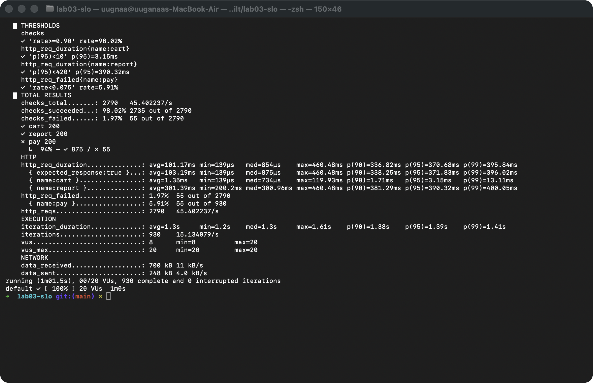
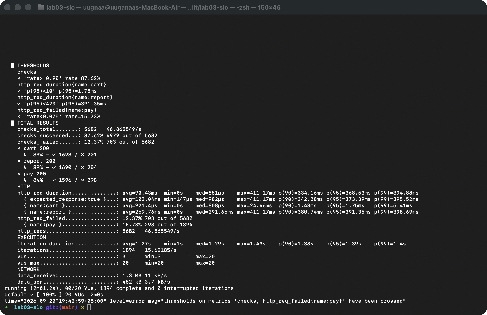
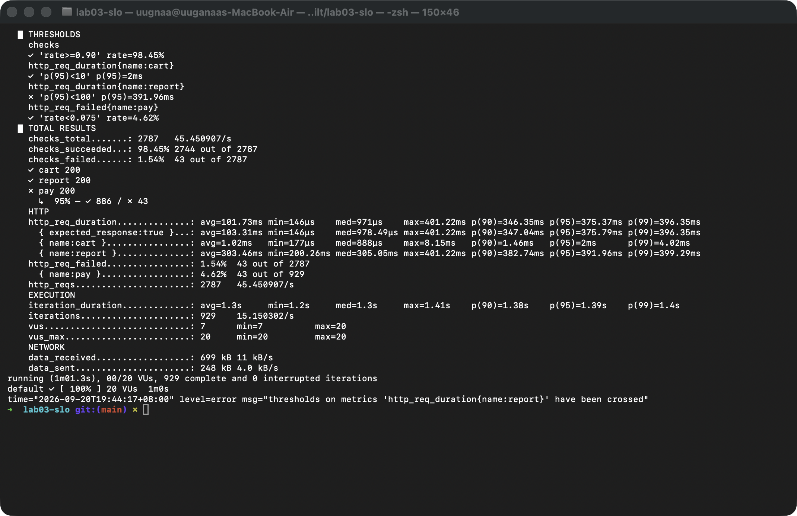

# Лаб 3: Чанарын сценарио, SLO, k6 threshold

Д.Ууганбаяр, b232270004
F.CSA313 Программ хангамжийн чанарын баталгаа ба туршилт

## Орчин

```
$ k6 version
k6 v2.0.0 (commit/devel, go1.26.3, darwin/arm64)
```

macOS, Node.js v22.18.0, express 5.2.1. Бүх тестийг зөвхөн өөрийн машин дээрх localhost:3000 руу хийсэн.

```bash
npm install
node server.js          # нэг терминалд

k6 run baseline.js      # нөгөө терминалд
k6 run slo-test.js
k6 run slo-test-fail.js
```

Тестээ бүтэн хугацаагаар нь ажиллуулах хэрэгтэй. Дөнгөж асаасан сервер эхний хүсэлтүүдэд удаан хариулдаг тул 10-20 секунд болгож богиносговол cart-ийн босго унаж магадгүй.

## Эхний ажиллуулалт

Босгоо шийдэхийн өмнө [baseline.js](baseline.js)-ийг зааврын жишээ босготойгоор ажиллуулж, өөрийн системийн бодит тоог харсан. Гаралт: [results/baseline.txt](results/baseline.txt)

| Хэмжүүр | Жишээ босго | Бодит |
|---|---|---|
| cart p95 | < 200 ms | 2.66 ms |
| report p95 | < 450 ms | 390.03 ms |
| pay алдаа | < 8% | 5.95% (55/924) |
| checks | > 90% | 98.01% |

20 VU нь секундэд 15 давталт хийж нийт 45.20 хүсэлт/с үүсгэсэн, өөрөөр хэлбэл endpoint бүр рүү 15 орчим хүсэлт/с очиж байна. Cart 2.66 ms-д хариулж байхад босго нь 200 ms байгаа юм чинь энэ босго юу ч шалгахгүй. Тиймээс өөрийн тоон дээрээ тулгуурлаж босгоо чангатгасан.

## Сценарио

Лекц 3-ын 6 хэсэгтэй формат.

### 1. Performance: сагсанд нэмэх

| Хэсэг | |
|---|---|
| Тойм | Хэвийн ачаалалтай үед сагсанд нэмэх хурдан ажиллах ёстой |
| Системийн төлөв | POST /cart/add, сервер асаад ажиллаж байгаа |
| Орчны төлөв | 20 VU, /cart/add руу 15 орчим хүсэлт/с, localhost |
| Гадаад өдөөлт | Хэрэглэгч "сагсанд нэмэх" дарна |
| Шаардлагатай хариу | 200, {ok: true} |
| Хэмжүүр | 1 минутад p95 < 10 ms |

### 2. Reliability: төлбөр

| Хэсэг | |
|---|---|
| Тойм | Төлбөр амжилтгүй болох магадлал тогтсон хэмжээнээс хэтрэхгүй байх |
| Системийн төлөв | POST /pay, gateway-г дуурайсан хэсэг нь 5 орчим хувьд 500 буцаадаг |
| Орчны төлөв | 20 VU, /pay руу 15 орчим хүсэлт/с |
| Гадаад өдөөлт | Хэрэглэгч энгийн төлбөр хийнэ |
| Шаардлагатай хариу | 200, {paid: true}. Алдаа гарвал 500 буцаагаад сервер унахгүй |
| Хэмжүүр | POFOD: 1 минутад (900 орчим төлбөр) 5xx < 7.5% |

### 3. Availability: сервер унаад дахин асах

| Хэсэг | |
|---|---|
| Тойм | Сервер гэнэт зогсоод асахад хэр хурдан сэргэх, хэдэн хүсэлт алдагдах |
| Системийн төлөв | Гурван endpoint, нэг node процесс |
| Орчны төлөв | 20 VU, 2 минут |
| Гадаад өдөөлт | Эвдрэл: серверийн процесс зогсоно (Ctrl+C), 10 секундийн дараа дахин асаана |
| Шаардлагатай хариу | Зогссон үед хүсэлт холболтын алдаа авна, асмагц өөр засваргүйгээр хэвийн хариулна |
| Хэмжүүр | 2 минутад амжилттай хүсэлт 90%-иас дээш, сэргэх хугацаа 12 секундээс бага |

Дөрөв дэх нэмэлт сценарио: 20 VU үед /report нээхэд 1 минутад p95 < 420 ms.

Таван шинжээр шалгахад тоонууд эхний ажиллуулалтаас гарсан тул итгэмжтэй, ачаалал ба цонхыг заасан тул нарийн байгаа гэж бодож байна. Сул тал нь reliability-ийн 7.5% бодит төлбөрийн системд хэтэрхий их алдаа, энэ нь зөвхөн "санаатай тавьсан 5%-аас дордоогүй" гэдгийг л шалгана.

## SLO

| Сценарио | SLI | Босго | Цонх |
|---|---|---|---|
| Performance | /cart/add latency | p95 < 10 ms | 20 VU, 1 мин |
| Reliability | /pay error rate | < 7.5% | 20 VU, 1 мин |
| Availability | бүх хүсэлтийн амжилт (checks) | 90%-иас дээш | 20 VU, 2 мин, 10 с зогсолттой |
| Нэмэлт | /report latency | p95 < 420 ms | 20 VU, 1 мин |

Яагаад эдгээр тоо:

- Cart: эхний ажиллуулалтад p95 2.66 ms байсан. localhost дээр 1-2 ms-ийн утга бага зэрэг хэлбэлзэхэд хэд дахин өөрчлөгддөг тул 10 ms болгож бага зэрэг зай үлдээсэн.
- Pay: сервер 5% алдаа гаргадаг, 1 минутад 900 орчим төлбөрт энэ хувь хагас хувиар хэлбэлздэг тул 7.5% гэвэл санамсаргүй унахгүй, харин алдаа нэмэгдвэл барина.
- Availability: 2 минутын 10% нь 12 секунд. 10 секундийн зогсолт багтах ёстой гэж 90% сонгосон.
- Report: сервер 200-400 ms санамсаргүй хүлээдэг тул p95 нь 390 ms орчим гарна (эхний ажиллуулалтад 390.03 ms). 30 ms зай нэмээд 420 ms болгосон.

Error budget цагаар: 2 минутын 10% буюу 12 секунд зогсох эрхтэй.

## PASS

[slo-test.js](slo-test.js) дотор endpoint бүрийг name tag-аар ялгаж, босгуудыг дээрх хүснэгтийн яг тоогоор бичсэн. Гаралт: [results/pass.txt](results/pass.txt), exit code 0.

| Threshold | Үр дүн |
|---|---|
| cart p(95)<10 | 3.15 ms |
| pay rate<0.075 | 5.91% |
| checks rate>=0.90 | 98.02% |
| report p(95)<420 | 390.32 ms |



## Chaos туршилт

Тестийг 2 минутаар ажиллуулаад 40 дэх секундэд нөгөө терминал дээр серверийг зогсоож, 10 секунд хүлээгээд дахин асаасан. Гаралт: [results/chaos.txt](results/chaos.txt)

k6-ийн лог дээр эхний алдаа 19:41:37-д, сүүлийнх нь 19:41:47-д бичигдсэн тул зогсолт 10 секунд үргэлжилсэн байна. Энэ нь сценариод бичсэн 12 секундээс бага тул сэргэх хугацааны хэмжүүр хангагдсан. Нийт 609 удаа connection refused гарсан.

| Threshold | Chaos үед |
|---|---|
| checks rate>=0.90 | 87.62% унасан |
| pay rate<0.075 | 15.73% унасан |
| cart p(95)<10 | 1.75 ms |
| report p(95)<420 | 391.35 ms |

exit code 99. Нэг зогсолт хоёр SLO-г зэрэг унагасан.

Availability-г хүсэлтээр тооцвол 4979 / 5682 = 87.62%. Budget нь 5682-ын 10% буюу 568 хүсэлт байхад 703 check унасан тул хэтэрсэн. Гэтэл цагаар бодвол 10 секунд нь 12 секундийн budget-д багтаж байгаа юм.

Хоёр тоо зөрж байгаа шалтгаан нь хоёр байна. Нэгдүгээрт, сервер унасан үед хүсэлт шууд алдаа авч буцдаг ба /report-ын 200-400 ms хүлээлт алга болдог тул VU-ууд илүү хурдан давтдаг: 10 секундэд 609 хүсэлт буюу секундэд 61 хүсэлт унасан, хэвийн үед 45.40 хүсэлт/с байсан. Хоёрдугаарт, checks нь /pay-ийн санаатай 500-г ч унасан гэж тоолдог: 703 алдааны 609 нь зогсолтынх, үлдсэн 94 нь санаатай 500. Тиймээс 12 секундийн budget хүсэлтээр бодоход (568 - 94) / 61 буюу 8 орчим секунд л болж таарч байна.

Reliability яагаад бас унав гэвэл /pay-ийн 298 алдааны 204 нь сервер байхгүй үед илгээсэн хүсэлт. Хоёр SLI-г салгахын тулд availability-г "сервер ямар нэг хариу өгсөн эсэх", reliability-г "хариу өгсөн хүсэлтүүдийн дундах 5xx хувь" гэж тодорхойлох хэрэгтэй байсан.



## FAIL

[slo-test-fail.js](slo-test-fail.js) нь slo-test.js-тэй ижил, зөвхөн /report-ын босгыг `p(95)<100` болгосон. Сервер 200 ms-ээс хурдан хариулдаггүй тул заавал унана. Гаралт: [results/fail.txt](results/fail.txt)

```
x 'p(95)<100' p(95)=391.96ms
level=error msg="thresholds on metrics 'http_req_duration{name:report}' have been crossed"
```

Энэ хоёр мөр FAIL-ийг харуулж байна, бусад босго давсан хэвээр (checks 98.45%, cart p95 2 ms, pay 4.62%). k6 exit code 99 буцаасан.

Нэг зүйл анзаарсан: зааврын дагуу `k6 run slo-test-fail.js | tee results/fail.txt; echo $?` гэж ажиллуулахад 0 гарч байна. Pipe-ийн дараах `$?` нь сүүлийн команд буюу tee-ийн код юм байна. Тиймээс би pipe-гүйгээр ажиллуулсан. CI дээр `| tee` бичвэл унасан тест ногоон харагдаж болохоор байна.



## Дүгнэлт

Сценариог SLO, дараа нь threshold болгоход хамгийн хэцүү нь босгын тоог сонгох байсан. Эхлээд зааврын жишээ босгоор ажиллуулж үзээгүй бол 200 ms-ийг хуулах байсан, гэтэл cart ердөө 2.66 ms-д хариулдаг. Босго бүрд өөр өөр үндэслэл хэрэгтэй болсон: cart-д localhost-ийн хэлбэлзэл, pay-д санаатай тавьсан 5% алдаа, report-д 200-400 ms-ийн хүлээлт. Эхлээд p99-д бас босго тавьсан боловч ажиллуулалт болгонд 10-аас 27 ms хүртэл хэлбэлзээд байсан тул хассан, p99 гэдэг хамгийн удаан 1% тул зөвхөн хэдэн хүсэлтээс хамаардаг юм байна. Chaos туршилт сэргэх хугацааны хэмжүүрийг баталсан, 10 секунд нь 12 секундээс бага. Харин availability 87.62% гарч 90%-ийн SLO-г зөрчсөн тул тэр хэмжүүрийг үгүйсгэсэн. Шалтгаан нь би budget-ээ цагаар бодсон атал checks нь хүсэлтээр тоолдог, сервер унасан үед хүсэлт хурдан унадаг тул нэг секунд нь илүү олон хүсэлт иддэг. Мөн нэг зогсолт reliability-г хамт унагасан нь хоёр SLI-г тусад нь тодорхойлох хэрэгтэйг харуулсан. Зогсолтын 10 секундийн ихэнх нь миний хүлээсэн хугацаа байсан тул бодит системд автоматаар дахин асаадаг зүйл байвал ийм урт зогсохгүй байх. Бас `| tee` ашиглахад k6-ийн exit code алдагддагийг олж мэдсэн нь CI дээр хэрэг болох байх.

## AI өнцөг (нэмэлт)

Claude-д server.js-ийн кодыг өгөөд "6 хэсэгтэй форматаар 3 чанарын сценарио бич" гэж шинэ чат дээр асуусан. Хариуг нь засалгүйгээр [ai/ai-scenarios.md](ai/ai-scenarios.md)-д хуулсан.

| | AI | Миний хэмжилт | Миний SLO |
|---|---|---|---|
| cart p95 | 50 ms-ээс бага | 1.75-3.15 ms | < 10 ms |
| report p95 | 450 ms-ээс бага | 390.03-391.96 ms | < 420 ms |
| pay | амжилт 99.5% (30 хоног) | алдаа 4.62-5.95% | < 7.5% |
| availability | байхгүй | 87.62% (chaos) | 90%-иас дээш |

AI-ийн /report-ын босго кодоос зөв бодогдсон бөгөөд миний хэмжилттэй таарч байна, харин cart-ийн 50 ms нь бодит 3 ms-ээс хамаагүй сул тул юу ч барихгүй. Хамгийн том дутуу нь availability сценарио огт бичээгүй, сервер унах өдөөлтийг мартсан. /pay дээр дахин оролдлого, idempotency key, alert гэж бичсэн ч server.js-д тэдгээр байхгүй тул байхгүй зүйл зохиосон байна. Мөн өдөөлтийг "хэрэглэгч төлөх" биш "gateway алдаа гаргах" болгосон, лекцийн форматын оронд Эх үүсвэр, Артефакт гэсэн өөр 6 хэсгээр бичсэн. Гэхдээ төлбөрт 99.5% амжилт, давхар төлбөр 0 гэсэн бодит шаардлага тавьсан нь миний 7.5%-аас илүү утгатай санагдсан. /report ажиллаж байхад cart удаашрахгүй байх ёстой гэсэн санаа ч надад байгаагүй. AI санаа өгөхөд сайн ч тоог хэмжилтгүй таамагладаг тул шалгалгүй хуулж болохгүй юм байна.
